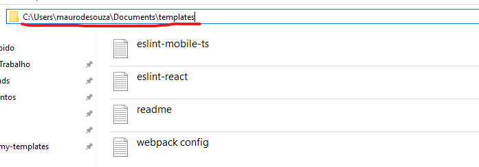

<h1>My templates</h1>

Generate your custom templates

<br>

<div align="center">
  
</div>

<br>


## Settings

Before using this extension, you need to pass the path where you want to save your templates.

```js
// settings.json

"mytemplates.path": "Path to your templates"
```

<br>

<div align="center">
  
</div>

<br>
